# Code Communication Graph

```mermaid
flowchart LR
    subgraph Laptop["Laptop / Test Host"]
        PIO["PlatformIO bench tests<br/>PWM/bench/test/pwm/*"]
        Runner["Bench runner<br/>PWM/bench/runners/common.py"]
        Scripts["Python test scripts<br/>PWM/Test_SPIN_API/scripts/test_pwm_*.py"]
        CutLib["CUT controller<br/>lib/cut_pwm.py"]
        MuxLib["MUX controller<br/>lib/mux_controller.py"]
        ScopeLib["Oscilloscope helper<br/>lib/oscilloscope.py"]
        ThingSet["ThingSet serial helper<br/>lib/thingset.py"]
    end

    subgraph CUT["CUT board firmware"]
        CutMain["CUT main.cpp"]
        CutControl["cut_pwm_control.h"]
        CutObjects["spin_data_objects.h"]
        CutSpin["SpinAPI / PWM HAL"]
    end

    subgraph MUX["MUX board firmware"]
        MuxMain["MUX main.cpp"]
        MuxControl["mux_control.h"]
        MuxObjects["spin_data_objects.h"]
        MuxSpin["SpinAPI / GPIO HAL"]
    end

    Scope["Rigol Oscilloscope"]

    PIO --> Runner
    Runner --> Scripts

    Scripts --> CutLib
    Scripts --> MuxLib
    Scripts --> ScopeLib

    CutLib --> ThingSet
    MuxLib --> ThingSet

    ThingSet -- "Serial ThingSet commands" --> CutObjects
    ThingSet -- "Serial ThingSet commands" --> MuxObjects

    CutObjects --> CutControl
    CutControl --> CutMain
    CutMain --> CutSpin
    CutSpin -- "Generates PWM signal" --> MuxSpin

    MuxObjects --> MuxControl
    MuxControl --> MuxMain
    MuxMain --> MuxSpin

    MuxSpin -- "Routes selected CUT pin" --> Scope
    ScopeLib -- "VISA / SCPI commands" --> Scope
    Scope -- "Measured values" --> Scripts
    Scripts -- "PASS / FAIL result" --> Runner
```

The PWM test architecture is controlled from the laptop. PlatformIO bench tests call the common bench runner, which launches the Python test scripts in `PWM/Test_SPIN_API/scripts`. These scripts use shared laptop-side libraries: `cut_pwm.py` sends ThingSet commands over serial to configure the CUT firmware, `mux_controller.py` sends ThingSet commands over serial to configure the MUX firmware, and `oscilloscope.py` communicates with the Rigol oscilloscope through VISA/SCPI. On the CUT board, `main.cpp`, `cut_pwm_control.h`, and `spin_data_objects.h` receive the requested PWM settings and use SpinAPI/PWM HAL code to generate the PWM signal. On the MUX board, `main.cpp`, `mux_control.h`, and `spin_data_objects.h` select which CUT pin is routed to the oscilloscope. The oscilloscope measures the routed signal and returns the values to the Python test script, which decides whether the test passes or fails.

## Block Commentary

### Bloc Laptop / Test Host

This bloc is the control side of the test bench. It does not generate the PWM signal itself; it launches the tests, sends configuration commands to the boards, controls the oscilloscope, and collects the final measurements.

| Element | Commentary |
| --- | --- |
| `PlatformIO bench tests` | PlatformIO is the test entry point. It starts the selected bench test from `PWM/bench/test/pwm/*` and waits for the final PASS/FAIL result. |
| `Bench runner` | The runner in `PWM/bench/runners/common.py` is the bridge between PlatformIO and the Python scripts. It reads `bench_config.json`, prepares the command line, checks Python dependencies, runs the script, and reports the result back to PlatformIO. |
| `Python test scripts` | These scripts contain the real test scenario, for example frequency, duty-cycle, dead-time, or burst-mode validation. They decide what to configure, what to measure, and whether the result is inside the expected tolerance. |
| `CUT controller` | `cut_pwm.py` is the laptop-side interface to the CUT board. It converts test requests such as PWM pin, frequency, duty cycle, dead time, or burst mode into ThingSet commands. |
| `MUX controller` | `mux_controller.py` is the laptop-side interface to the MUX board. It selects which CUT pin is routed to which oscilloscope channel. |
| `Oscilloscope helper` | `oscilloscope.py` controls the Rigol oscilloscope through VISA/SCPI. It configures channels, trigger, timebase, and reads measurements such as frequency, duty cycle, period, `RFDelay`, and `FRDelay`. |
| `ThingSet serial helper` | `thingset.py` is the shared serial communication layer. Both the CUT controller and MUX controller use it to send GET, UPDATE, and EXEC commands to firmware data objects. |

### Bloc CUT SPIN

This bloc is the board under test. It receives commands from the laptop and applies them to the Spin PWM API so the requested electrical PWM signal is generated on the selected CUT pin.

| Element | Commentary |
| --- | --- |
| `CUT main.cpp` | Main firmware entry point for the CUT board. It initializes the application and keeps the firmware running so incoming ThingSet commands can be handled. |
| `cut_pwm_control.h` | CUT-side PWM control logic. It takes the values exposed through ThingSet and applies them to the PWM configuration used by the firmware. |
| `spin_data_objects.h` | CUT ThingSet data model. It exposes writable and readable objects such as frequency, duty cycle, enable flags, dead-time values, status, and action nodes. |
| `SpinAPI / PWM HAL` | Low-level PWM layer used by the CUT firmware. It translates the requested configuration into timer/HRTIM behavior and generates the physical PWM waveform. |

### Bloc MUX SPIN

This bloc is the routing board. It does not create the PWM signal; it selects the path between the CUT output pin and the oscilloscope input so the correct signal can be measured.

| Element | Commentary |
| --- | --- |
| `MUX main.cpp` | Main firmware entry point for the MUX board. It initializes the routing firmware and keeps the command interface available. |
| `mux_control.h` | MUX-side routing logic. It applies the requested channel, mux index, input index, and enable state to the physical routing hardware. |
| `spin_data_objects.h` | MUX ThingSet data model. It exposes the routing objects that the laptop writes to, and it allows route readback for diagnostics. |
| `SpinAPI / GPIO HAL` | Low-level GPIO/routing layer used by the MUX firmware. It drives the hardware selection pins that connect the chosen CUT signal to the output path. |

### Bloc Oscilloscope

This bloc is the measurement instrument. It receives the PWM signal routed by the MUX, measures the requested electrical values, and sends those values back to the Python test script.

| Element | Commentary |
| --- | --- |
| `Rigol Oscilloscope` | Physical measurement device. It measures frequency, duty cycle, period, rise/fall delay, and other timing values depending on the test. |
| `VISA / SCPI commands` | Command protocol used by the laptop oscilloscope helper to configure the Rigol and request measured values. |
| `Measured values` | Measurement results returned by the oscilloscope to the Python script. The script compares them with expected values and decides PASS or FAIL. |

## Communication Summary

| Link | Commentary |
| --- | --- |
| `PlatformIO bench tests -> Bench runner` | PlatformIO starts the custom runner for the selected bench test. |
| `Bench runner -> Python test scripts` | The runner launches the configured Python script as a subprocess with arguments from `bench_config.json` and environment variables. |
| `Python test scripts -> CUT controller` | The script asks the CUT controller to configure PWM outputs, disable outputs during cleanup, or run burst/dead-time actions. |
| `Python test scripts -> MUX controller` | The script asks the MUX controller to route one or two CUT pins to oscilloscope channels. |
| `Python test scripts -> Oscilloscope helper` | The script asks the oscilloscope helper to configure acquisition settings and read measurements. |
| `CUT/MUX controller -> ThingSet serial helper` | Both controllers use the same serial helper so board commands are sent in a consistent ThingSet format. |
| `ThingSet serial helper -> CUT/MUX data objects` | Serial ThingSet commands land on the firmware data objects, where host-side values become firmware-visible settings. |
| `CUT data objects -> CUT control -> CUT main -> PWM HAL` | CUT firmware applies the requested configuration and produces the PWM waveform. |
| `MUX data objects -> MUX control -> MUX main -> GPIO HAL` | MUX firmware applies the requested route and connects the selected CUT signal to the measurement output. |
| `CUT PWM HAL -> MUX GPIO HAL -> Rigol Oscilloscope` | The generated PWM signal passes through the selected MUX path and arrives at the oscilloscope input. |
| `Oscilloscope helper <-> Rigol Oscilloscope` | VISA/SCPI commands configure the instrument and retrieve measured values. |
| `Rigol Oscilloscope -> Python test scripts -> Bench runner` | Measurements return to the test script, which evaluates tolerances and reports PASS or FAIL to PlatformIO. |
